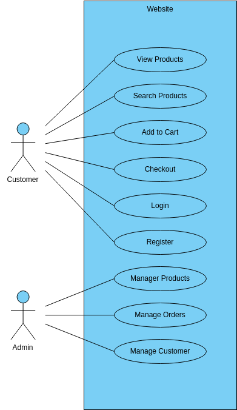

##Project1
<h1> ECommerce project </h1>
#welcome

Along with the growth of the Internet, the trend shows that e-commerce have been growing significantly inthe last several years. This means business opportunities for small-medium enterprises (SMEs), which arerecognized as the backbone of the economy. SMEs may develop and run small to medium size of particulare-commerce websites  as the solution  of specific business opportunities. Certainly, the  websites should bedeveloped accordingly to support business success. In developing the websites, key elements of e-commercebusiness model that are necessary to ensure the success should be resolved at the requirement stage of thedevelopment. In  this  paper,  we  propose an  enhancement  of requirement  analysis  method found  inliteratures such that it includes activities to resolve the key elements. The method has been applied in threecase studies based on Indonesia situations and we conclude that it is suitable to be adopted by SMEs.
